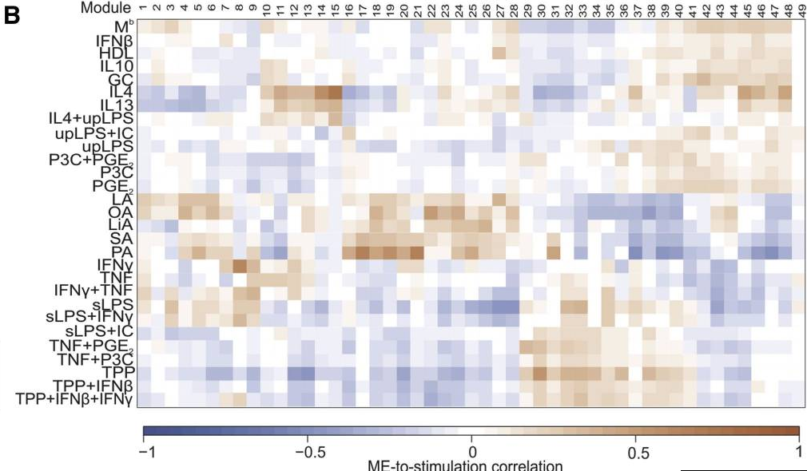
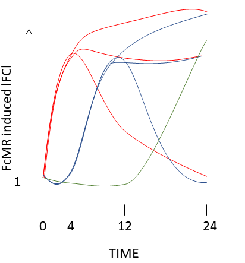
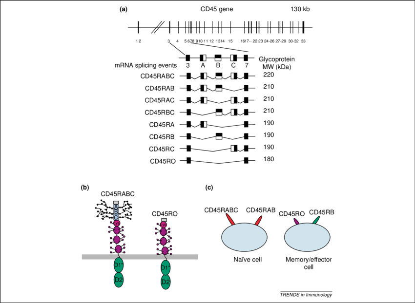

# 1. R requirements

## Install and load packages

### Install CRAN
```{r}
# CRAN packages
list.of.packages <- c("tidyr",
                      "dplyr",
                      "ggplot2",
                      "ggrepel",
                      "gplots",
                      "ggbeeswarm",
                      "hexbin",
                      "reshape2",
                      "factoextra",
                      "Hmisc",
                      "VennDiagram",
                      "openxlsx",
                      "readxl")

new.packages <- list.of.packages[!(list.of.packages %in% installed.packages()[,"Package"])]

if(length(new.packages)>0) install.packages(new.packages)
```

### Install BioConductor

```{r}
# BioconductoR packages
list.of.bioc.packages<- c("rhdf5",
                          "clusterProfiler",
                          "DOSE",
                          "GSEABase",
                          "RColorBrewer",
                          "ComplexHeatmap",
                          "tximport",
                          "DESeq2",
                          "vsn",
                          "pheatmap",
                          "genefilter",
                          "biomaRt",
                          "limma",
                          "sva",
                          "IHW",
                          "org.Mm.eg.db",
                          "org.Hs.eg.db",
                          "Gviz")

new.packages.bioc <- list.of.bioc.packages[!(list.of.bioc.packages %in% installed.packages()[,"Package"])]
 
if(length(new.packages.bioc)>0)if (!requireNamespace("BiocManager")) install.packages("BiocManager")
BiocManager::install(new.packages.bioc, update = FALSE)
```

### Load Packages

```{r load packages, results='hide',message=FALSE,warning=FALSE}
lapply(c(list.of.packages,list.of.bioc.packages), require, character.only = TRUE)
```

## Custom functions

```{r}
source("Functions_Embgenbroich_2020.R")
```


# 2. Project information

*Please specify important information on the data set.*

* Scienfitic question: What influence does the Mannose Receptor have on BMDCs?

* IDs: "3347" "3348" "3349" "3350" "3351" "3352" "3353" "3354" "3355" "3356" "3357" "3358" "3359" "3360" "3361" "3362" "3363" "3364" "3365" "3366" "3367"
* Conditions: FcMR or Isotype control for 0h, 4h, 12h, 24h
* Species: Mouse
* Cell type(s): BMDC
* RNA-isolation: Trizol
* Library-Production: TruSeq RNA Sample Prep Kits V2

**Specify the organism of the data set**

```{r}
organism = "mouse" # choose "mouse" or "human"
```

# 3. Data Import

## Load gene annotation

```{r gene annotation import}
# Specify the filename of your gene annotation file here: 
annotation_filename <- "ID2SYMBOL_gencode_vM16_transcript.txt"

tx_annotation <- read.delim(file.path("data", annotation_filename), 
                         header = F , 
                         stringsAsFactors = F,
                         col.names = c("GENEID", "TXNAME", "SYMBOL", "GENETYPE"))
```

## Load gene set annotation

We downloaded gene set annotations from ensembl and MsigDB, loaded them into R and saved them as a RData object for easy upload to github.

6 gene sets are available:

* GO
* KEGG
* MSigDB Hallmark (H)
* MSigDB Cannonical Pathways (C2) *Gene sets from pathway databases. Usually, these gene sets are canonical representations of a biological process compiled by domain experts.*  
* MSigDB Motifs (C3, DNA binding motifs) *Gene sets representing potential targets of regulation by transcription factors or microRNAs. The sets consist of genes grouped by short sequence motifs they share in their non-protein coding regions. The motifs represent known or likely cis-regulatory elements in promoters and 3'-UTRs. The C3 collection is divided into two sub-collections: MIR and TFT*  
* MSigDB Immunologic gene sets (C7) *Gene sets that represent cell states and perturbations within the immune system. The signatures were generated by manual curation of published studies in human and mouse immunology.*


```{r}
# # GO
# GO_mm <- read.delim(file.path("data/GMTfiles/GO_mm38p12_ensembl181121.txt"),header=TRUE,stringsAsFactors = FALSE,quote="")
# # KEGG
# KEGG_mm <- read.delim(file.path("data/GMTfiles/KEGG_mm10_clusterProfiler181121.txt"),header=TRUE,stringsAsFactors = FALSE)
# # MiSigDB gene sets
# hallmark_genes <- clusterProfiler::read.gmt(file.path("data/GMTfiles/h.all.v6.2.entrez.gmt"))
# cannonicalPathway_genes <- clusterProfiler::read.gmt(file.path("data/GMTfiles/c2.cp.v6.2.entrez.gmt"))
# immuno_genes <- clusterProfiler::read.gmt(file.path("data/GMTfiles/c7.all.v6.2.entrez.gmt"))
# motifs <- clusterProfiler::read.gmt(file.path("data/GMTfiles/c3.all.v6.2.entrez.gmt"))
# save.image(file="GeneSetAnnotation.RData")


load(file="data/GeneSetAnnotation.RData")
```

## Load sample table

```{r sample table import}
sample_table <- read.delim("data/sample_table.txt")
rownames(sample_table) <- sample_table$ID
```


### Format sample table

```{r colour definitions}
## Add columns with factors for comparisons in model
sample_table$condition <- factor(sample_table$condition,
                                   levels = c("construct_untreated_0h",
                                              "construct_isotype_4h", 
                                              "construct_FcMR_4h", 
                                              "construct_isotype_12h",
                                              "construct_FcMR_12h", 
                                              "construct_isotype_24h",
                                              "construct_FcMR_24h"))

sample_table$time <- factor(sample_table$time, 
                           levels = c("0h", "4h", "12h", "24h"))

# order according to factor of interest
sample_table <- sample_table[order(sample_table$condition),]

# define factor for order of samples in plotting 
plot_order <- "condition"
```

### Colour scheme customization

```{r}
# time
col_time = brewer.pal(4,"Greens")
names(col_time) <- c("0h", "4h", "12h", "24h")
# condition
col_condition <- c("#848c8e","#007090","#ff7a69","#004060","#df503e","#000020","#c13929")
names(col_condition) <- as.character(unique(sample_table$condition))

# combine color code into list
ann_colors <- list(time = col_time,
                   condition = col_condition)

```


# 4. TXimport

A new and recommended pipeline for RNA-seq analysis is to use fast transcript abundance quantifiers, such as kallisto or Salmon, upstream of DESeq2, and then to create gene-level count matrices for use with DESeq2 by importing the quantification data using the tximport package.

We use tximport and DESeq2 based on the gene-level estimated counts from Kallisto (Bray, Pimentel, Melsted, Pachter 2016). 

Some advantages of using this methods for transcript abundance estimation are: 

  * this approach corrects for potential changes in gene length across samples (e.g. from differential isoform usage) (Trapnell et al. 2013), 
  * some of these methods (Salmon, Sailfish, kallisto) are substantially faster and require less memory and disk usage compared to alignment-based methods that require creation and storage of BAM files, and,
  * it is possible to avoid discarding those fragments that can align to multiple genes with homologous sequence, thus increasing sensitivity (Robert and Watson 2015).

Full details on the motivation and methods for importing transcript level abundance and count estimates, summarizing to gene-level count matrices and producing an offset which corrects for potential changes in average transcript length across samples are described in (Soneson, Love, and Robinson 2015). Note that the tximport-to-DESeq2 approach uses estimated gene counts from the transcript abundance quantifiers, but not normalized counts.

TXimport imports transcript-level abundance, estimated counts and transcript lengths, and summarizes these into matrices for use with downstream statistical analysis packages such as edgeR, DESeq2, limma-voom. 
Average transcript length, weighted by sample-specific transcript abundance estimates, is provided 
as a matrix, which is then used as an offset for different expression of gene-level counts.

```{r kallisto import}
# Define path where the Kallisto files are stored
files <- paste("data/kallisto/", sample_table$ID, "/abundance.h5", sep = "")
# Naming the entries in the vector assures correct column names in the expression tables
names(files) <- sample_table$ID
# Import samples and perform the distribution of transcripts to genes
txi_kallisto <- tximport(files, 
                         type="kallisto", 
                         tx2gene=tx_annotation[,2:1])
```

# 5. Building the DESeqDataSet

The object class used by the DESeq2 package to store the read counts and the intermediate estimated quantities during statistical analysis is the DESeqDataSet, which will usually be represented in the code here as an object called "dds". 

A DESeqDataSet object must have an associated design formula. The design formula expresses the variables which will be used in modeling. The formula should be a tilde (~) followed by the variables with plus signs between them (it will be coerced into a formula if it is not already). The design can be changed later, however then all differential analysis steps should be repeated, as the design formula is used to estimate the dispersions and to estimate the log2 fold changes of the model.

```{r DESeqDatasetFromTXimport}
dds_txi <- DESeqDataSetFromTximport(txi = txi_kallisto, 
                                    colData = sample_table,
                                    design = ~ condition)
```

## Pre-filtering

While it is not necessary to pre-filter low count genes before running the DESeq2 functions, there are two reasons which make pre-filtering useful: 

1) by removing rows in which there are very few reads, we reduce the memory size of the dds data object, and 

2) we increase the speed of the transformation and testing functions within DESeq2. 

Here, we perform a minimal pre-filtering to keep only rows that have at least 10 reads total. 

*Note that more strict filtering to increase power is automatically applied via independent filtering or independent hypothesis weighting on the mean of normalized counts within the results function.*

```{r pre-filtering}
genes_to_keep <- rowSums(counts(dds_txi)) >= 10
dds <- dds_txi[genes_to_keep,]
```

**Number of genes after filtering is:** `r sum(genes_to_keep) `

## DESeq calculations

**DESeq2:** Estimate variance-mean dependence (2) in count data from high-throughput sequencing assays and test for differential expression based on a model using the negative binomial distribution (1).

1) In inferential testing a distributional assumption is needed because we want to estimate the probability of extreme events just appearing by chance (e.g. large fold change) from limited replicates. The test statistic of ANOVA (or t-test) follows a Student's t distribution, a specific case of the normal distribution. However, counts, as produced in RNA-seq experiments, cannot be normally distributed by definition(you can't have -3 counts, or 12.2 counts). Two distributions for count based data are Poisson, which presumes that the variance and mean are equal, or negative binomial, a.k.a. Gamma-Poisson, which does not. The spread of values among biological replicates is more than given by the one parameter Poisson distribution and it seems to be captured by the two parameter (mean & variance) NB sufficiently well.

2) Information sharing across genes for variance estimation:  
In order to test the differential expression of a gene, we need to estimate its mean and variance for the underlying negative binomial distribution. Inferential methods that treat each gene separately suffer from the high uncertainty of within-group variance estimates. However, this limitation can be overcome by pooling information across genes, specifically, by exploiting assumptions about the similarity of the variances of different genes measured in the same experiment . DESeq2 detects and corrects dispersion estimates through modeling of the dependence of the dispersion on the average mean over all samples.

The standard differential expression analysis steps are wrapped into a single function, DESeq(). The estimation steps performed by this function are described in the manual page for ?DESeq and in the Methods section of the DESeq2 publication (Love, Huber, and Anders 2014).

This function performs a default analysis through the steps:

  1. Estimation of size factors: estimateSizeFactors

  2. Estimation of dispersion: estimateDispersions

  3. Negative Binomial GLM fitting and Wald statistics: nbinomWaldTest

For complete details on each step, see the manual pages of the respective functions. 

```{r DESeq calculation}
dds <- DESeq(dds)
```

## Normalized count table  

For inspection of the normalized data, we write the normalized counts into a data.frame called "norm_anno".

```{r gene annotation}
norm_anno <- as.data.frame(counts(dds, normalized=T))
norm_anno$GENEID <- row.names(norm_anno)

# add gene annotation extracted from the gtf file
gene_annotation <- tx_annotation[!duplicated(tx_annotation$GENEID),c("GENEID", "SYMBOL", "GENETYPE")]
gene_annotation <- gene_annotation[match(rownames(norm_anno), gene_annotation$GENEID),]

# check if row names of the normalized table and the gene annotation match perfectly
all(rownames(norm_anno) == gene_annotation$GENEID)

# add additional gene annotation downloaded from biomart
biomart <- read.delim(file.path("data/biomart_180914.txt"), stringsAsFactors = FALSE)
idx <- match(unlist(lapply(strsplit(gene_annotation$GENEID, split = "[.]"), `[[`, 1)), biomart$Gene.stable.ID)
gene_annotation$DESCRIPTION <- biomart$Gene.description[idx]
gene_annotation$CHR <- biomart$Chromosome.scaffold.name[idx]

# merge expression table and annotation
norm_anno <- merge(norm_anno,
                   gene_annotation,
                   by = "GENEID")
rownames(norm_anno) <- norm_anno$GENEID

norm_anno[1:3,c(1:2, (ncol(norm_anno)-5):ncol(norm_anno))]
```

## Variance stabilizing transformation

In order to test for differential expression, we operate on raw counts and use discrete distributions. However for other downstream analyses - e.g. for visualization or clustering - it might be useful to work with transformed versions of the count data.  

Maybe the most obvious choice of transformation is the logarithm. Since count values for a gene can be zero in some conditions (and non-zero in others), some advocate the use of pseudocounts, i.e. transformations of the form: y=log2(n+n0) where n represents the count values and n0 is a positive constant.

DESeq2 has two alternative approaches that offer more theoretical justification and a rational way of choosing parameters equivalent to n0 above. One makes use of the concept of variance stabilizing transformations (VST) (Tibshirani 1988; Huber et al. 2003; Anders and Huber 2010), and the other is the regularized logarithm or rlog, which incorporates a prior on the sample differences (Love, Huber, and Anders 2014). Both transformations produce transformed data on the log2 scale which has been normalized with respect to library size or other normalization factors.

The point of these two transformations, the VST and the rlog, is to remove the dependence of the variance on the mean, particularly the high variance of the logarithm of count data when the mean is low. Both VST and rlog use the experiment-wide trend of variance over mean, in order to transform the data to remove the experiment-wide trend. Note that we do not require or desire that all the genes have exactly the same variance after transformation. Indeed, in a figure below, you will see that after the transformations the genes with the same mean do not have exactly the same standard deviations, but that the experiment-wide trend has flattened. It is those genes with row variance above the trend which will allow us to cluster samples into interesting groups.

The two functions, vst and rlog have an argument blind, for whether the transformation should be blind to the sample information specified by the design formula. When blind equals TRUE (the default), the functions will re-estimate the dispersions using only an intercept. **This setting should be used in order to compare samples in a manner wholly unbiased by the information about experimental groups, for example to perform sample QA (quality assurance) as demonstrated below.**

However, blind dispersion estimation is not the appropriate choice if one expects that many or the majority of genes (rows) will have large differences in counts which are explainable by the experimental design, and one wishes to transform the data for downstream analysis. In this case, using blind dispersion estimation will lead to large estimates of dispersion, as it attributes differences due to experimental design as unwanted noise, and will result in overly shrinking the transformed values towards each other. By setting blind to FALSE, the dispersions already estimated will be used to perform transformations, or if not present, they will be estimated using the current design formula. Note that only the fitted dispersion estimates from mean-dispersion trend line are used in the transformation (the global dependence of dispersion on mean for the entire experiment). So setting blind to FALSE is still for the most part not using the information about which samples were in which experimental group in applying the transformation.

```{r varStab}
dds_vst <- rlog(dds, blind = TRUE)
```

***

# 6. Exploratory Data Analysis

Specify sample annotation for plotting
```{r}
# choose columns from sampletable for heatmap annotation
plot_annotation <- sample_table[,c("time",
                                   "condition"), drop = F]

rownames(plot_annotation) <- sample_table$ID
```

## Boxplots of highest expressed genes

```{r, fig.height=10}
highestGenes(numGenes = 50)
```

## Hierarchical Clustering of all present genes {.tabset .tabset-fade}

Plot a heatmap of all hierarchically clustered present genes.

_I case your machine has only 8 gb of ram, plotting a heatmap of all present genes might exceed your memory capacities and give the error: "Error: cannot allocate vector of size XX Gb". In that case, you can either reduce the genes to present based on a higher expression cutoff or continue with the heatmap of variable genes._

### clustered Columns & Rows
```{r, echo=TRUE, fig.height=10, fig.width=12}
plotHeatmap(geneset = "all",
            title = "Heatmap of all present genes",
            show_rownames = FALSE,
            cluster_cols = TRUE)
```

### clustered Rows
```{r, echo=TRUE, message=FALSE, results='hide', fig.height=10, fig.width=12}
plotHeatmap(geneset = "all",
                title = "Heatmap of all present genes",
                show_rownames = FALSE,
                cluster_cols = FALSE)
```

```{r,echo=FALSE,message=FALSE}
gc()
```

## Hierarchical Clustering of most variable genes {.tabset .tabset-fade}

```{r, echo=TRUE}
# define variable genes
rv = genefilter::rowVars(assay(dds_vst))
q75 = quantile(rowVars(assay(dds_vst)), .75)
q75_names = names(which(rv > q75))
```

###  clustered Columns & Rows
```{r, echo=TRUE, message=FALSE, results='hide', fig.height=10, fig.width=12}
plotHeatmap(geneset = q75_names,
            title = "Heatmap of most variable genes",
            show_rownames = FALSE,
            cluster_cols = TRUE,
            font.size=10)
```

###  clustered Rows
```{r, echo=TRUE, message=FALSE, results='hide', fig.height=10, fig.width=12}
plotHeatmap(geneset = q75_names,
            title = "Heatmap of most variable genes",
            show_rownames = FALSE,
            cluster_cols = FALSE,
            font.size=12)
```

## Principle Component Analysis 

Related to the distance matrix is the PCA plot, which shows the samples in the 2D plane spanned by two principal components. This type of plot is useful for visualizing the overall effect of experimental covariates and batch effects.

Principal component analysis (PCA) simplifies the complexity in high-dimensional data while retaining trends and patterns. It does this by transforming the data into fewer dimensions, which act as summaries of features. High-dimensional data are very common in biology and arise when multiple features, such as expression of many genes, are measured for each sample. This type of data presents several challenges that PCA mitigates: computational expense and an increased error rate due to multiple test correction when testing each feature for association with an outcome. PCA is an unsupervised learning method and is similar to clustering1—it finds patterns without reference to prior knowledge about whether the samples come from different treatment groups or have phenotypic differences.

To understand the basics of PCA, please watch: https://www.youtube.com/watch?v=_UVHneBUBW0

### Percentage of explained variance of PCs
```{r, fig.height=4, fig.width=6}
# Extract the eigenvalues/variances of the principal dimensions
eigenvalue <- get_eig(prcomp(t(assay(dds_vst))))
eigenvalue$dim <- as.numeric(c(1:nrow(eigenvalue)))

ggplot(eigenvalue, aes(dim, variance.percent))+ 
  geom_bar(stat = "identity")+
  geom_line(aes(dim, variance.percent)) +
  geom_point(aes(dim, variance.percent)) +
  geom_line(aes(dim, cumulative.variance.percent), colour= "grey") + 
  geom_point(aes(dim, cumulative.variance.percent), colour= "grey") + 
  scale_x_continuous(breaks=c(1:nrow(eigenvalue)))+
  xlab("Dimensions") +
  ylab("Percentage of explained variances") +
  theme_bw()
```

### Plot PCA {.tabset .tabset-fade}

#### PC1 & PC2
```{r, fig.width=6, fig.height=6}
plotPCA(ntop="all", 
        xPC=1, 
        yPC=2,
        color="condition",
        anno_colour = col_condition,
        point_size=3,
        label= "ID",
        title="Principle Component Analysis based on variance-stabilized counts")
```

#### PC2 & PC3
```{r, fig.width=6, fig.height=6}
plotPCA(ntop="all", 
        xPC=2, 
        yPC=3,
        color="condition",
        anno_colour = col_condition,
        point_size=3,
        label= "ID",
        title="Principle Component Analysis based on variance-stabilized counts")
```

### PCA loadings

#### PC1 {.tabset .tabset-fade}

```{r}
plotLoadings(PC="PC1", ntop="all", cluster_cols = FALSE)
```

#### PC2 

```{r}
plotLoadings(PC="PC2", ntop="all", cluster_cols = FALSE)
```

#### PC3

```{r}
plotLoadings(PC="PC3", ntop="all", cluster_cols = FALSE)
```

## Expression of selected genes across conditions {.tabset .tabset-fade}

Plot the expression of selected genes across conditions.

### Nfkb1
```{r, fig.height=6}
plotSingleGene(data=norm_anno, 
                 symbol="Nfkb1", 
                 condition="condition",
                 anno_colour=col_condition,
                 shape= NULL)
```

### Cd25
```{r, fig.height=6}
plotSingleGene(data=norm_anno, 
                 symbol="Il2ra", 
                 condition="condition",
                 anno_colour=col_condition,
                 shape= NULL)
```

### Ptgs2/Cox2
```{r, fig.height=6}
plotSingleGene(data=norm_anno, 
                 symbol="Ptgs2", 
                 condition="condition",
                 anno_colour=col_condition,
                 shape= NULL)
```

### Il10
```{r, fig.height=6}
plotSingleGene(data=norm_anno, 
                 symbol="Il10", 
                 condition="condition",
                 anno_colour=col_condition,
                 shape= NULL)
```

### Ido1
```{r, fig.height=6}
plotSingleGene(data=norm_anno, 
                 symbol="Ido1", 
                 condition="condition",
                 anno_colour=col_condition,
                 shape= NULL)
```

# 7. Differential Expression Analysis

After the DESeq() function performs the standard differential expression analysis steps, DESeq2's results() function can extract a result table from the DESeqDataSet giving base means across samples, log2 fold changes, standard errors, test statistics, p-values and adjusted p-values.

We have written a function called DEAnalysis() that runs DESeq2's results() and the lfcShrink() function with specified parameters on a set of pre-defined comparisons and returns a single DEresults object containing the respective result tables together with additional lists of the significant DE genes and the number of DE genes found.

The parameters of the DEAnalysis function are: 

  1) condition: specify the condition that you are testing, e.g. treatment or genotype. This value must correspond to the column in the colData listing the factors you are comparing and the design formula. 

  2) alpha:  a significance cutoff used for optimizing the independent filtering.(default= 0.05)
  
  3) lfcThreshold: a non-negative value which specifies a log2 fold change threshold. The default value is 0, corresponding to a test that the log2 fold changes are equal to zero. (default = 0)
  
  4) sigFC: post testing significance criteria as a non-negative, non-log transformed FC cutoff (default = 2)
  
  5) multiple_testing: By default independent hypothesis weighting will be used as the multiple testing method (https://bioconductor.org/packages/3.7/bioc/vignettes/IHW/inst/doc/introduction_to_ihw.html). However, you can also edit the multiple testing method by setting the multiple_testing parameter to "holm", "hochberg", "hommel", "bonferroni", "BH", "BY",or "fdr", which will perform independent filtering and p-value adjustment according to the specified method. (default = "IHW")
  
  6) shrinkage: After calculating differential expression statistics, we can perform a so-called log2 fold change shrinkage. This shrinkage of effect size (LFC estimates) is useful for visualization and ranking of genes, as it removes the noise associated with log2 fold changes from low count genes without requiring arbitrary filtering thresholds. To shrink the LFC, set shrinkage = TRUE to pass the dds object to the function lfcShrink.  (default = TRUE)

  7) shrinkType: The options for the shrinkage type are:

* "normal" is the the original DESeq2 shrinkage estimator, an adaptive Normal distribution as prior.This is currently the default, although the default will likely change to apeglm in the October 2018 release given apeglm’s superior performance.

* "apeglm" is the adaptive t prior shrinkage estimator from the apeglm package (Zhu, Ibrahim, and Love 2018).

* "ashr" is the adaptive shrinkage estimator from the ashr package (Stephens 2016). Here DESeq2 uses the ashr option to fit a mixture of Normal distributions to form the prior, with method="shrinkage".


## Define relevant comparisons

Define your comparisons in a data.frame with "comparison" in the first column and "control" in the second column.

```{r}
comparison_table<-data.frame(comparison = c("construct_FcMR_4h",
                                            "construct_FcMR_12h",
                                            "construct_FcMR_24h"),
                             control = c("construct_isotype_4h",
                                         "construct_isotype_12h",
                                         "construct_isotype_24h")
)
```


## Perform Differential Expression Testing

```{r}
DEresults <- DEAnalysis(condition = "condition",
                        alpha=0.05 ,
                        lfcThreshold= 0,
                        sigFC = 2,
                        multiple_testing="IHW",
                        shrinkage = TRUE,
                        shrinkType="normal")
str(DEresults)
```

### Summary of DE genes

We use a for loop to print the number of significantly up- and down-regulated genes over all comparisons.

```{r, fig.height=6, fig.width=6}
DEcounts <- NULL

for(i in 1:nrow(comparison_table)){
  tmp <- unlist(DEresults[[1+i]]@Number_DE_genes)
  DEcounts <- rbind(DEcounts, tmp)
}

rownames(DEcounts) <- names(DEresults)[-1]

DEcounts
```

## 7.1 General DE Gene analysis

### Hierarchical Clustering of the union of DE genes 

```{r, echo=TRUE, message=FALSE, results='hide', fig.height=10, fig.width=12}
# the uDEG() function produces the union of the DE genes from the specified comparisons
allDEgenes <- uDEG(comparisons=c("construct_FcMR_4h_vs_construct_isotype_4h",
                                 "construct_FcMR_12h_vs_construct_isotype_12h",
                                 "construct_FcMR_24h_vs_construct_isotype_24h"))

plotHeatmap(geneset = allDEgenes,
            title = "Heatmap of all differentially expressed genes",
            show_rownames = FALSE,
            cluster_cols = FALSE)
```

### Venn diagrams

```{r, fig.height=12, fig.width=12}
plotVenn(comparisons =  c("construct_FcMR_4h_vs_construct_isotype_4h", 
                          "construct_FcMR_12h_vs_construct_isotype_12h"),
         regulation ="up")

plotVenn(comparisons =  c("construct_FcMR_4h_vs_construct_isotype_4h", 
                          "construct_FcMR_12h_vs_construct_isotype_12h"),
         regulation ="down")

plotVenn(comparisons =  c("construct_FcMR_12h_vs_construct_isotype_12h", 
                          "construct_FcMR_24h_vs_construct_isotype_24h"),
         regulation ="up")

plotVenn(comparisons =  c("construct_FcMR_12h_vs_construct_isotype_12h", 
                          "construct_FcMR_24h_vs_construct_isotype_24h"),
         regulation ="down")

plotVenn(comparisons =  c("construct_FcMR_4h_vs_construct_isotype_4h", 
                          "construct_FcMR_24h_vs_construct_isotype_24h"),
         regulation ="up")

plotVenn(comparisons =  c("construct_FcMR_4h_vs_construct_isotype_4h", 
                          "construct_FcMR_24h_vs_construct_isotype_24h"),
         regulation ="down")
```


### Ratio-Ratio plots of DE genes

Ratio-Ratio plots help to compare the DE genes of two comparisons and are much more expressive than venn diagrams. 

```{r}
plotRatios(comp1 = "construct_FcMR_4h_vs_construct_isotype_4h",  
           comp2 = "construct_FcMR_12h_vs_construct_isotype_12h")
plotRatios(comp1 = "construct_FcMR_12h_vs_construct_isotype_12h",  
           comp2 = "construct_FcMR_24h_vs_construct_isotype_24h")
plotRatios(comp1 = "construct_FcMR_4h_vs_construct_isotype_4h",  
           comp2 = "construct_FcMR_24h_vs_construct_isotype_24h")
```

### Fold change rank plots

```{r, fig.height=6,fig.width=6}
plotFCrank(comp1 = "construct_FcMR_4h_vs_construct_isotype_4h",  
           comp2 = "construct_FcMR_12h_vs_construct_isotype_12h")
plotFCrank(comp1 = "construct_FcMR_12h_vs_construct_isotype_12h",  
           comp2 = "construct_FcMR_24h_vs_construct_isotype_24h")
plotFCrank(comp1 = "construct_FcMR_4h_vs_construct_isotype_4h",  
           comp2 = "construct_FcMR_24h_vs_construct_isotype_24h")
```


### GSEA across comparisons

Define universe and gene sets for subsequent GSEA analyses.

```{r}
# define universe
universe <- as.character(norm_anno$SYMBOL)
# change symbols to ENTREZ IDs (necessary for ClusterProfiler)
universe_Entrez <- bitr(universe, 
                        fromType="SYMBOL", 
                        toType="ENTREZID", 
                        OrgDb="org.Mm.eg.db")$ENTREZID

universe_mouse2human <- getLDS(attributes = c("mgi_symbol"), 
                              filters = "mgi_symbol", 
                              values = universe, 
                              mart = useMart("ensembl", dataset = "mmusculus_gene_ensembl"), 
                              attributesL = c("hgnc_symbol"), 
                              martL = useMart("ensembl", dataset = "hsapiens_gene_ensembl"), 
                              uniqueRows=T)[,2]

universe_mouse2human_Entrez <- bitr(universe_mouse2human, 
                        fromType="SYMBOL", 
                        toType="ENTREZID", 
                        OrgDb="org.Hs.eg.db")$ENTREZID
```

Next, we perform functional enrichment analysis based on Gene ontology and KEGG pathway enrichment across all comparisons tested to check for overlap in functional indications of the differentially regulated genes. 

```{r, fig.height=8, fig.width=22, warnings=FALSE, message=FALSE}
DEcompare <- compareGSEA(comparisons = c("construct_FcMR_4h_vs_construct_isotype_4h",
                                         "construct_FcMR_12h_vs_construct_isotype_12h",
                                         "construct_FcMR_24h_vs_construct_isotype_24h"),
                         organism = "mouse",
                         GeneSets = c("GO", "KEGG"),
                         pCorrection = "bonferroni", 
                         pvalueCutoff = 0.05,
                         qvalueCutoff = 0.05,
                         showMax = 10, 
                         ontology = "BP")

DEcompare$GOplot
DEcompare$KEGGplot
```

**Supplemental Figure 2A**

```{r}
up_4h <- DEresults$construct_FcMR_4h_vs_construct_isotype_4h@DE_genes$up_regulated_Genes$SYMBOL
up_12h <- DEresults$construct_FcMR_12h_vs_construct_isotype_12h@DE_genes$up_regulated_Genes$SYMBOL
up_24h <- DEresults$construct_FcMR_24h_vs_construct_isotype_24h@DE_genes$up_regulated_Genes$SYMBOL

up_shared <- Reduce(union,list(intersect(up_4h,up_12h),
                               intersect(up_4h,up_24h),
                               intersect(up_24h,up_12h)))

up_4h_u <- up_4h[!up_4h %in% up_shared]
up_12h_u <- up_12h[!up_12h %in% up_shared]
up_24h_u <- up_24h[!up_24h %in% up_shared]

OrgDb = org.Mm.eg.db

ENTREZlist <-  list()
ENTREZlist$shared <- bitr(up_shared, fromType = "SYMBOL", toType="ENTREZID", OrgDb=OrgDb)$ENTREZID
ENTREZlist$up_4h <- bitr(up_4h, fromType = "SYMBOL", toType="ENTREZID", OrgDb=OrgDb)$ENTREZID
ENTREZlist$up_4h_u <- bitr(up_4h_u, fromType = "SYMBOL", toType="ENTREZID", OrgDb=OrgDb)$ENTREZID
ENTREZlist$up_12h <- bitr(up_12h, fromType = "SYMBOL", toType="ENTREZID", OrgDb=OrgDb)$ENTREZID
ENTREZlist$up_12h_u <- bitr(up_12h_u, fromType = "SYMBOL", toType="ENTREZID", OrgDb=OrgDb)$ENTREZID
ENTREZlist$up_24h <- bitr(up_24h, fromType = "SYMBOL", toType="ENTREZID", OrgDb=OrgDb)$ENTREZID
ENTREZlist$up_24h_u <- bitr(up_24h_u, fromType = "SYMBOL", toType="ENTREZID", OrgDb=OrgDb)$ENTREZID

CompareClusters_GO <- compareCluster(geneCluster = ENTREZlist, 
                                         fun = "enrichGO",  
                                         universe = universe_Entrez,
                                         OrgDb = OrgDb,
                                         ont = "BP", 
                                         pvalueCutoff  = 0.1, 
                                         pAdjustMethod = "bonferroni", 
                                         qvalueCutoff  = 0.1,  
                                         readable      = T)
```


```{r}
x <- as.data.frame(CompareClusters_GO)
x <- x %>% group_by(Cluster) %>% top_n(10, Count)
x <- x[order(x$Count,decreasing=FALSE),]
x$Description <- ifelse(nchar(x$Description)>50,paste(substr(x$Description, 1, 50)," [...](",x$ID,")",sep=""),paste(x$Description,"(",x$ID,")",sep=""))
x$Description <- factor(x$Description, levels = unique(x$Description))
x$GeneRatio <- factor(x$GeneRatio, levels = unique(x$GeneRatio))

ggplot(x, aes(x = Cluster, y = Description, color = p.adjust)) +
  geom_point(aes(size = Count)) +
  scale_colour_gradientn(colours=c('red', 
                                   'orange', 
                                   'darkblue',
                                   'darkblue'),
                         limits=c(0,1),
                         values   = c(0,0.05,0.2,0.5,1),
                         breaks   = c(0.05,0.2,1),
                         labels = format(c(0.05,0.2,1))) +
  ylab(NULL) +
  theme_bw() +
  theme(text = element_text(size=8),
        plot.title = element_text(size=10),
        axis.text.x = element_text(angle = 25, hjust = 1)) 
```


## 7.2 Specific DE Gene analysis

Now that we have had a global look at the differentially expressed genes, we want to have a more detailed look at specific comparisons. Therefore, we use various plots to get an impression of the differences in the specified comparisons.

### MAplots

A MAplot represents the average log expression versus the average ratio (or fold change) between two conditions.

```{r, fig.width=6, fig.height=4}
  plotMA(comparison = "construct_FcMR_4h_vs_construct_isotype_4h",
         ylim=c(-2,2))
  plotMA(comparison = "construct_FcMR_12h_vs_construct_isotype_12h",
         ylim=c(-2,2))
  plotMA(comparison = "construct_FcMR_24h_vs_construct_isotype_24h",
         ylim=c(-2,2))
```

### p value distributions

We plot a histogram of the p-values resulting from testing the specified comparisons.

To understand p-value distributions, this source is very helpful:
http://varianceexplained.org/statistics/interpreting-pvalue-histogram/

```{r, fig.width=7, fig.height=4}
  plotPvalues(comparison="construct_FcMR_4h_vs_construct_isotype_4h")

  plotPvalues(comparison="construct_FcMR_12h_vs_construct_isotype_12h")
  
  plotPvalues(comparison="construct_FcMR_24h_vs_construct_isotype_24h")
```

### Heatmaps of DE genes

Plot heatmaps of the expression of the DE genes of the specified comparisons. The argument conditions allows to include samples from specified conditions in the heatmap.

```{r,fig.height=8,fig.width=6}
  plotDEHeatmap("construct_FcMR_4h_vs_construct_isotype_4h",
                factor="condition",
                conditions=c("construct_isotype_4h","construct_FcMR_4h"))
  
  plotDEHeatmap("construct_FcMR_12h_vs_construct_isotype_12h",
                factor="condition",
                conditions=c("construct_isotype_12h","construct_FcMR_12h"))

  plotDEHeatmap("construct_FcMR_24h_vs_construct_isotype_24h",
                factor="condition",
                conditions=c("construct_isotype_24h","construct_FcMR_24h"))
```

### Volcano Plots

A volcano plot is a type of scatter-plot that is used to quickly identify changes in large data sets composed of replicate data. It plots significance versus fold-change on the y and x axes, respectively. 

```{r}
plotVolcano(comparison= "construct_FcMR_4h_vs_construct_isotype_4h",
            labelnum=20)

plotVolcano(comparison= "construct_FcMR_12h_vs_construct_isotype_12h",
            labelnum=20)

plotVolcano(comparison= "construct_FcMR_24h_vs_construct_isotype_24h",
            labelnum=20)
```

### NFkB target genes

A list of NFkB target genes was downloaded from https://www.bu.edu/nf-kb/gene-resources/target-genes/ and curated as explained below. 

```{r}
# NFkB_targets <- read_xlsx("data/NFkBtargets_210429_bu-edu.xlsx",skip = 3)
# 
# ensembl_hs <- bitr(NFkB_targets$`Human Gene Name`,
#                     fromType="SYMBOL",
#                     toType="ENSEMBL",
#                     OrgDb="org.Hs.eg.db",drop = F)
# idx <- match(NFkB_targets$`Human Gene Name`,ensembl_hs$SYMBOL)
# NFkB_targets$ensemblID_hs <- ensembl_hs$ENSEMBL[idx]
# 
# NFkB_targets_mm <- getLDS(attributes = c("hgnc_symbol"), 
#                       filters = "hgnc_symbol", 
#                       values = NFkB_targets$`Human Gene Name`, 
#                       mart = useMart("ensembl", dataset = "hsapiens_gene_ensembl"), 
#                       attributesL = c("mgi_symbol","ensembl_gene_id"), 
#                       martL = useMart("ensembl", dataset = "mmusculus_gene_ensembl"), 
#                       uniqueRows=T,verbose = T)
# 
# idx <- match(NFkB_targets$`Human Gene Name`,NFkB_targets_mm$HGNC.symbol)
# NFkB_targets$`Murine Gene Name` <- NFkB_targets_mm$MGI.symbol[idx]
# NFkB_targets$ensemblID_mmu <- NFkB_targets_mm$Gene.stable.ID[idx]
# 
# for(i in 1:nrow(NFkB_targets)){
#   if(is.na(NFkB_targets$ensemblID_mmu[i])){
#     print(NFkB_targets$`Human Gene Name`[i])
#     tmp <- biomart[grep(paste("^",NFkB_targets$`Human Gene Name`[i],"$",sep=""), biomart$Gene.name, ignore.case = T,fixed = ),,drop=F]
#     print(paste(tmp$Gene.name,tmp$Gene.stable.ID,sep="|"))
#     if(nrow(tmp)==1){
#       NFkB_targets$ensemblID_mmu[i] <- tmp$Gene.stable.ID
#       NFkB_targets$`Murine Gene Name`[i] <- tmp$Gene.name  
#     }
#     
#   }else{print(".")}
# }
# 
# write.xlsx(NFkB_targets,"data/NFkBtargets_210429_bu-edu_manualcuration.xlsx")

# Manual Curation!

NFkB_targets <- read_xlsx("data/NFkBtargets_210429_bu-edu_manualcuration.xlsx")
length(unique(NFkB_targets$`Murine Gene Name`))

NFkB_targets_present <- NFkB_targets$ensemblID_mmu[NFkB_targets$ensemblID_mmu %in%  unlist(lapply(strsplit(norm_anno$GENEID, split = "[.]"), `[[`, 1))]
length(unique(NFkB_targets_present))

NFkB_targets$present_in_dataset <- ifelse(NFkB_targets$ensemblID_mmu %in% NFkB_targets_present, "present", "")

NFkB_targets_DE <- NFkB_targets$ensemblID_mmu[NFkB_targets$ensemblID_mmu %in% unlist(lapply(strsplit(allDEgenes, split = "[.]"), `[[`, 1))]
length(unique(NFkB_targets_DE))
NFkB_targets$DifferentiallyExpressed <- ifelse(NFkB_targets$ensemblID_mmu %in% NFkB_targets_DE, "DE", "")

 write.xlsx(NFkB_targets,"data/NFkBtargets_210429_bu-edu_embgenbroich.xlsx")
```
#### Heatmaps

All present NFkB targets
```{r, fig.height=8,fig.width=6}
plotHeatmap(geneset = norm_anno$GENEID[grepl(paste(NFkB_targets_present,collapse="|"),norm_anno$GENEID)],
            title = "Heatmap of all 351 NFkB target genes present in the data set (118 DE)",
            show_rownames = FALSE,
            cluster_cols = FALSE)
```

DE NFkB Targets
```{r, fig.height=12,fig.width=12}
g <- allDEgenes[grepl(paste(NFkB_targets_DE,collapse="|"),allDEgenes)]
l = length(g)

plotHeatmap(geneset = g,
            title = paste("Heatmap of all ", l, " differentially expressed NFkB Target genes (417 annotated in DB)",sep=""),
            show_rownames = TRUE,
            cluster_cols = FALSE)
```
NKfB Targets with BaseMean Cutoff

```{r}
BaseMean <- DEresults$construct_FcMR_4h_vs_construct_isotype_4h@results[,c("GENEID","SYMBOL","baseMean")]
str(BaseMean)
```
```{r, fig.width=10,fig.height=12}
cutoff = 100
g <- allDEgenes[grepl(paste(NFkB_targets_DE,collapse="|"),allDEgenes)]
g <- g[g %in% BaseMean[BaseMean$baseMean > cutoff,]$GENEID]
l = length(g)

plotHeatmap(geneset = g,
            title = paste("Heatmap of ", l, " differentially expressed NFkB Target Genes (417 annotated in DB) with BaseMean > ",cutoff,sep=""),
            show_rownames = TRUE,
            cluster_cols = FALSE)
```


Numbers of NFkB targets among DE genes with specified cut-offs in all three comparisons

```{r}
NFkB_list <- list()

for(j in c("construct_FcMR_4h_vs_construct_isotype_4h",
           "construct_FcMR_12h_vs_construct_isotype_12h",
           "construct_FcMR_24h_vs_construct_isotype_24h")){
  print(j)
  x <- as.data.frame(DEresults[[j]]@results)
  x <- x[x$regulation %in% c("up","down"),]
  x$NFKBtarget <- ifelse(unlist(lapply(strsplit(x$GENEID, split = "[.]"), `[[`, 1)) %in% NFkB_targets_present, "NFkB target","")
  NFkB_list[[paste(j)]] <- x[,c("GENEID","SYMBOL","comparison", "baseMean", "regulation","NFKBtarget")]
  for(i in c(10,50,100,250,500,1000)){
    y <- x[x$baseMean > i,]
    v <- y[grepl(paste(NFkB_targets_present,collapse="|"),y$GENEID),]
    print(paste(nrow(v), " of 417 annotated NFkB targets among ", nrow(y), " DE genes with BaseMean cut-off of ", i, " (",round((nrow(v)/nrow(y))*100,2),"%)",sep=""))
  }
}
```

```{r}
CombinedDE <- list()
for(j in c("construct_FcMR_4h_vs_construct_isotype_4h",
           "construct_FcMR_12h_vs_construct_isotype_12h",
           "construct_FcMR_24h_vs_construct_isotype_24h")){
  x <- as.data.frame(DEresults[[j]]@results)
  x <- x[x$regulation %in% c("up","down"),]
  x$NFKBtarget <- ifelse(unlist(lapply(strsplit(x$GENEID, split = "[.]"), `[[`, 1)) %in% NFkB_targets_present, "NFkB target","")
  CombinedDE[[paste(j)]] <- x[,c("GENEID","SYMBOL","comparison", "baseMean", "regulation","NFKBtarget")]
}
CombinedDE.df <- do.call(rbind, CombinedDE)
CombinedDE.df <- CombinedDE.df[!duplicated(CombinedDE.df$GENEID),]

for(i in c(1,10,50,100,250,500,1000)){
    y <- CombinedDE.df[CombinedDE.df$baseMean > i,]
    v <- y[grepl(paste(NFkB_targets_present,collapse="|"),y$GENEID),]
    z <- as.data.frame(DEresults[["construct_FcMR_4h_vs_construct_isotype_4h"]]@results)
    z <- z[grepl(paste(NFkB_targets_present,collapse="|"),z$GENEID),]
    z <- z[z$baseMean > i,]
    print(paste(nrow(v), " of ",nrow(z) ,"/351 (",round((nrow(v)/nrow(z))*100,2),"%) present NFkB targets among ", nrow(y), " DE genes with BaseMean cut-off of ", i, " (",round((nrow(v)/nrow(y))*100,2),"%)",sep=""))
  }
```


#### MA plots

```{r, fig.width=12,fig.height=12}
maplot_label <- function(comparison, 
         padjThreshold=0.05,
         color_list,
         color_order,
         color_hex,
         label_incl=FALSE,
         gene_column = "GENEID",
         labelnum=20){
  x <- as.data.frame(DEresults[[comparison]]@results)
  
  if (!(is.data.frame(x) && all(c("baseMean", "log2FoldChange") %in% colnames(x)))){
    stop("'x' must be a data frame with columns named 'baseMean', 'log2FoldChange'.")
  }
  
  # specify labeling    
  upDE <-  as.data.frame(DEresults[[comparison]]@results[DEresults[[comparison]]@results$regulation =="up",]) 
  FClabel_up <- upDE[order(abs(upDE$log2FoldChange), decreasing = TRUE),]
  if(nrow(FClabel_up)>labelnum){
    FClabel_up <- as.character(FClabel_up[c(1:labelnum),"GENEID"])
  } else {
    FClabel_up <- as.character(FClabel_up$GENEID)}
  plabel_up <- upDE[order(upDE$padj, decreasing = FALSE),]
  if(nrow(plabel_up)>labelnum){
    plabel_up <- as.character(plabel_up[c(1:labelnum),"GENEID"])
  } else {
    plabel_up <- as.character(plabel_up$GENEID)}
  
  downDE <-  as.data.frame(DEresults[[comparison]]@results[DEresults[[comparison]]@results$regulation =="down",]) 
  FClabel_down <- downDE[order(abs(downDE$log2FoldChange), decreasing = TRUE),]
  if(nrow(FClabel_down)>labelnum){
    FClabel_down <- as.character(FClabel_down[c(1:labelnum),"GENEID"])
  } else {
    FClabel_down <- as.character(FClabel_down$GENEID)}
  plabel_down <- downDE[order(downDE$padj, decreasing = FALSE),]
  if(nrow(plabel_down)>labelnum){
    plabel_down <- as.character(plabel_down[c(1:labelnum),"GENEID"])
  } else {
    plabel_down <- as.character(plabel_down$GENEID)}
  
  
  label<- unique(c(FClabel_up, plabel_up, FClabel_down, plabel_down))
  
  data <- DEresults[[comparison]]@results
  data <- data[data$regulation %in% c("up","down"),]
  data$label<- ifelse(data$GENEID %in% label == "TRUE",as.character(data$SYMBOL), "")
  
  if(label_incl == TRUE){
      data$label <- NULL
      data$label<- ifelse(unlist(lapply(strsplit(data[,gene_column] , split = "[.]"), `[[`, 1)) %in% do.call(c, color_list) == "TRUE",
                          as.character(data$SYMBOL), "")
    }
    
    if(!is.null(color_list)){
      data$color <- "not incl"
      for(i in 1:length(color_list)){
        data$color <- ifelse(data$color == "not incl" & 
                               unlist(lapply(strsplit(data[,gene_column] , split = "[.]"), `[[`, 1)) %in% color_list[[i]] == "TRUE", 
                             names(color_list)[i],
                             data$color)   
      }
      data$color <- factor(data$color, levels = color_order)
      # MA Plot
      ggplot(data=na.omit(data), aes(x=baseMean, y=log2FoldChange)) + 
        geom_point(data=na.omit(data[data$color == "not incl",]), aes(color=color), size=1.75) +
        geom_point(data=na.omit(data[!data$color == "not incl",]), aes(color=color), size=1.75) +
        scale_color_manual(values=color_hex)+
        scale_x_log10() +
        scale_y_continuous(limits=c(-4,4)) +
        geom_vline(xintercept = c(10,50,100,250,500,1000)) + 
        geom_text(aes(x = 15, y=-3, label = paste(round((nrow(data[data$baseMean>10 & !data$color == "not incl",])/nrow(data[data$baseMean>10,]))*100,2)," %",sep=""),
                      vjust = -0.5), col = "black")+
        geom_text(aes(x = 75, y=-3, label = paste(round((nrow(data[data$baseMean>50 & !data$color == "not incl",])/nrow(data[data$baseMean>50,]))*100,2), " %",sep=""),
                      vjust = -0.5), col = "black")+
        geom_text(aes(x = 150, y=-3, label = paste(round((nrow(data[data$baseMean>100 & !data$color == "not incl",])/nrow(data[data$baseMean>100,]))*100,2), " %",sep=""),
                      vjust = -0.5), col = "black")+
        geom_text(aes(x = 375, y=-3, label = paste(round((nrow(data[data$baseMean>250 & !data$color == "not incl",])/nrow(data[data$baseMean>250,]))*100,2), " %",sep=""),
                      vjust = -0.5), col = "black")+
        geom_text(aes(x = 750, y=-3, label = paste(round((nrow(data[data$baseMean>500 & !data$color == "not incl",])/nrow(data[data$baseMean>500,]))*100,2), " %",sep=""),
                      vjust = -0.5), col = "black")+
        geom_text(aes(x = 1500, y=-3, label = paste(round((nrow(data[data$baseMean>1000 & !data$color == "not incl",])/nrow(data[data$baseMean>1000,]))*100,2), " %",sep=""),
                      vjust = -0.5), col = "black")+
        xlab("baseMean") +
        ylab("log2(FoldChange)") +
        geom_vline(xintercept = 0, colour="black")+
        geom_text_repel(data=na.omit(data[!data$label =="",]),aes(label=label), size=3,  colour = 'grey')+
        theme_bw()+ 
        ggtitle(comparison)
    }else{
      # MA Plot
      ggplot(data=na.omit(data), aes(x=baseMean, y=log2FoldChange)) + 
        geom_point(size=1.75) +
        scale_x_log10() +
        scale_y_continuous() +
        xlab("baseMean") +
        ylab("log2(FoldChange)") +
        geom_vline(xintercept = 0, colour="black")+
        geom_text_repel(data=na.omit(data[!data$label =="",]),aes(label=label), size=3,  colour = 'grey')+
        guides(colour=FALSE) + 
        theme_bw()+ ggtitle(comparison)   
    }
}


p1 <- maplot_label(comparison="construct_FcMR_4h_vs_construct_isotype_4h", 
             color_list=list("NFkB_targets"=NFkB_targets_DE),
             color_order=c("not incl", "NFkB_targets"),
             color_hex = c("not incl"="#a7a6a5", 
                           "NFkB_targets"="#5D63A1"),
             label_incl=TRUE)

p2 <- maplot_label(comparison="construct_FcMR_12h_vs_construct_isotype_12h", 
             color_list=list("NFkB_targets"=NFkB_targets_DE),
             color_order=c("not incl", "NFkB_targets"),
             color_hex = c("not incl"="#a7a6a5", 
                           "NFkB_targets"="#5D63A1"),
             label_incl=TRUE)

p3 <- maplot_label(comparison="construct_FcMR_24h_vs_construct_isotype_24h", 
             color_list=list("NFkB_targets"=NFkB_targets_DE),
             color_order=c("not incl", "NFkB_targets"),
             color_hex = c("not incl"="#a7a6a5", 
                           "NFkB_targets"="#5D63A1"),
             label_incl=TRUE)

CombinePlots(plots = list(p1,p2,p3),
             ncol=1)
```


### Gene Set Enrichment of DE genes

Next, we perform gene set enrichment analyses of the DE genes of the specified comparisons. 

#### Construct 4h {.tabset .tabset-fade}

```{r, fig.height=8, fig.width=12}
GSEA_FcMR_vs_Isotype_4h <-  GSEA(comparison="construct_FcMR_4h_vs_construct_isotype_4h",
                                 organism="mouse",
                                 GeneSets = c("GO",
                                              "KEGG",
                                              "DO",
                                              "Hallmark",
                                              "cannonicalPathways",
                                              "Motifs",
                                              "ImmunoSignatures"),
                                 GOntology = "BP",
                                 pCorrection = "bonferroni",
                                 pvalueCutoff = 0.2,
                                 qvalueCutoff = 0.2)
```

##### GO
```{r, fig.height=12, fig.width=12}
dotplotGSEA(GSEA_FcMR_vs_Isotype_4h$GOup)
```

```{r, fig.height=12, fig.width=12}
dotplotGSEA(GSEA_FcMR_vs_Isotype_4h$GOdown)
```

##### KEGG
```{r, fig.height=12, fig.width=12}
dotplotGSEA(GSEA_FcMR_vs_Isotype_4h$KEGGup)
```

```{r, fig.height=12, fig.width=12}
dotplotGSEA(GSEA_FcMR_vs_Isotype_4h$KEGGdown)
```

##### Disease Ontology
```{r, fig.height=12, fig.width=12}
dotplotGSEA(GSEA_FcMR_vs_Isotype_4h$DOup)
```

```{r, fig.height=12, fig.width=12}
dotplotGSEA(GSEA_FcMR_vs_Isotype_4h$DOdown)
```

##### Cannonical Pathway
```{r, fig.height=12, fig.width=12}
dotplotGSEA(GSEA_FcMR_vs_Isotype_4h$cannonicalPathwaysup)
```

```{r, fig.height=12, fig.width=12}
dotplotGSEA(GSEA_FcMR_vs_Isotype_4h$cannonicalPathwaysdown)
```

##### Motifs
```{r, fig.height=12, fig.width=12}
dotplotGSEA(GSEA_FcMR_vs_Isotype_4h$Motifup)
```

**Edges and Nodes for Motif enrichment network analysis in Cytoscape**

```{r}
motifs_4hup <- as.data.frame(GSEA_FcMR_vs_Isotype_4h$Motifup)

for(i in 1:nrow(motifs_4hup)){
  tmp <- motifs_4hup[i,]
  Target_hs <- bitr(unlist(strsplit(tmp$geneID,"/")),
                    fromType="ENTREZID",
                    toType="SYMBOL",
                    OrgDb="org.Hs.eg.db")$SYMBOL
  Target_mm <- getLDS(attributes = c("hgnc_symbol"), 
                      filters = "hgnc_symbol", 
                      values = Target_hs, 
                      mart = useMart("ensembl", dataset = "hsapiens_gene_ensembl"), 
                      attributesL = c("mgi_symbol"), 
                      martL = useMart("ensembl", dataset = "mmusculus_gene_ensembl"), 
                      uniqueRows=T)
  tmp <- data.frame(TF=tmp$Description,
                    Target_hs=Target_mm[,1],
                    Target_mm=Target_mm[,2],
                    Connection=1)
  if(i==1){
    edges_4hup <- tmp
  }else{
    edges_4hup <- rbind(edges_4hup,tmp)
  }
}

nodes_4hup <- DEresults$construct_FcMR_4h_vs_construct_isotype_4h@results[,c(2,3,7:14)]
nodes_4hup <- nodes_4hup[nodes_4hup$regulation=="up",]
nodes_4hup <- nodes_4hup[nodes_4hup$SYMBOL %in% edges_4hup$Target_mm,]
edges_4hup <- edges_4hup[edges_4hup$Target_mm %in% nodes_4hup$SYMBOL,]

# write files for cytoscape
# write.csv(edges_4hup,
#           paste("edges_4hup.csv",sep=""),
#           row.names = FALSE,
#           quote = FALSE)
# 
# 
# write.csv(nodes_4hup,
#           paste("nodes_4hup.csv",sep=""),
#           row.names = FALSE,
#           quote = FALSE)
```


```{r, fig.height=12, fig.width=12}
dotplotGSEA(GSEA_FcMR_vs_Isotype_4h$Motifdown)
```

##### Hallmark
```{r, fig.height=12, fig.width=12}
dotplotGSEA(GSEA_FcMR_vs_Isotype_4h$HALLMARKup)
```

```{r, fig.height=12, fig.width=12}
dotplotGSEA(GSEA_FcMR_vs_Isotype_4h$HALLMARKdown)
```

##### Immunesignatures
```{r, fig.height=12, fig.width=12}
dotplotGSEA(GSEA_FcMR_vs_Isotype_4h$ImmSigup)
```

```{r, fig.height=12, fig.width=12}
dotplotGSEA(GSEA_FcMR_vs_Isotype_4h$ImmSigdown)
```

#### Heatmaps of enriched gene sets

```{r, fig.height=10,fig.width=12}
plotGSEAHeatmap(GSEA_result = GSEA_FcMR_vs_Isotype_4h$GOup, 
              GeneSet="GO", 
              term = "positive regulation of cytokine production")

plotGSEAHeatmap(GSEA_result = GSEA_FcMR_vs_Isotype_4h$KEGGup, 
              GeneSet="KEGG", 
              term = "Cytokine-cytokine receptor interaction")

plotGSEAHeatmap(GSEA_result = GSEA_FcMR_vs_Isotype_4h$HALLMARKup, 
              GeneSet="HALLMARK", 
              term = "HALLMARK_INTERFERON_GAMMA_RESPONSE",
              font.size = 10)

plotGSEAHeatmap(GSEA_result = GSEA_FcMR_vs_Isotype_4h$HALLMARKup, 
              GeneSet="HALLMARK", 
              term = "HALLMARK_TNFA_SIGNALING_VIA_NFKB",
              font.size = 10)

plotGSEAHeatmap(GSEA_result = GSEA_FcMR_vs_Isotype_4h$Motifup, 
              GeneSet="Motifs", 
              term = "IRF7_01",
              font.size = 10)

plotGSEAHeatmap(GSEA_result = GSEA_FcMR_vs_Isotype_4h$ImmSigup, 
              GeneSet="ImmunoSignatures", 
              term = "GSE26343_UNSTIM_VS_LPS_STIM_NFAT5_KO_MACROPHAGE_DN")
```


#### Construct 12h {.tabset .tabset-fade}
```{r, fig.height=12, fig.width=12}
GSEA_FcMR_vs_Isotype_12h <-  GSEA(comparison="construct_FcMR_12h_vs_construct_isotype_12h",
                                 organism="mouse",
                                 GeneSets = c("GO",
                                              "KEGG",
                                              "DO",
                                              "Hallmark",
                                              "cannonicalPathways",
                                              "Motifs",
                                              "ImmunoSignatures"),
                                 GOntology = "BP",
                                 pCorrection = "bonferroni",
                                 pvalueCutoff = 0.2,
                                 qvalueCutoff = 0.2)
```

##### GO
```{r, fig.height=12, fig.width=12}
dotplotGSEA(GSEA_FcMR_vs_Isotype_12h$GOup)
```

```{r, fig.height=12, fig.width=12}
dotplotGSEA(GSEA_FcMR_vs_Isotype_12h$GOdown)
```

##### KEGG
```{r, fig.height=12, fig.width=12}
dotplotGSEA(GSEA_FcMR_vs_Isotype_12h$KEGGup)
```

```{r, fig.height=12, fig.width=12}
dotplotGSEA(GSEA_FcMR_vs_Isotype_12h$KEGGdown)
```

##### Disease Ontology
```{r, fig.height=12, fig.width=12}
dotplotGSEA(GSEA_FcMR_vs_Isotype_12h$DOup)
```

```{r, fig.height=12, fig.width=12}
dotplotGSEA(GSEA_FcMR_vs_Isotype_12h$DOdown)
```

##### Cannonical Pathway
```{r, fig.height=12, fig.width=12}
dotplotGSEA(GSEA_FcMR_vs_Isotype_12h$cannonicalPathwaysup)
```

```{r, fig.height=12, fig.width=12}
dotplotGSEA(GSEA_FcMR_vs_Isotype_12h$cannonicalPathwaysdown)
```

##### Motifs
```{r, fig.height=12, fig.width=12}
dotplotGSEA(GSEA_FcMR_vs_Isotype_12h$Motifup)
```

**Edges and Nodes for Motif enrichment network analysis in Cytoscape**

```{r}
motifs_12hup <- as.data.frame(GSEA_FcMR_vs_Isotype_12h$Motifup)

for(i in 1:nrow(motifs_12hup)){
  tmp <- motifs_12hup[i,]
  Target_hs <- bitr(unlist(strsplit(tmp$geneID,"/")),
                    fromType="ENTREZID",
                    toType="SYMBOL",
                    OrgDb="org.Hs.eg.db")$SYMBOL
  Target_mm <- getLDS(attributes = c("hgnc_symbol"), 
                      filters = "hgnc_symbol", 
                      values = Target_hs, 
                      mart = useMart("ensembl", dataset = "hsapiens_gene_ensembl"), 
                      attributesL = c("mgi_symbol"), 
                      martL = useMart("ensembl", dataset = "mmusculus_gene_ensembl"), 
                      uniqueRows=T)
  tmp <- data.frame(TF=tmp$Description,
                    Target_hs=Target_mm[,1],
                    Target_mm=Target_mm[,2],
                    Connection=1)
  if(i==1){
    edges_12hup <- tmp
  }else{
    edges_12hup <- rbind(edges_12hup,tmp)
  }
}

nodes_12hup <- DEresults$construct_FcMR_12h_vs_construct_isotype_12h@results[,c(2,3,7:14)]
nodes_12hup <- nodes_12hup[nodes_12hup$regulation=="up",]
nodes_12hup <- nodes_12hup[nodes_12hup$SYMBOL %in% edges_12hup$Target_mm,]
edges_12hup <- edges_12hup[edges_12hup$Target_mm %in% nodes_12hup$SYMBOL,]

# write files for cytoscape
# write.csv(edges_12hup,
#           paste("edges_12hup.csv",sep=""),
#           row.names = FALSE,
#           quote = FALSE)
# 
# 
# write.csv(nodes_12hup,
#           paste("nodes_12hup.csv",sep=""),
#           row.names = FALSE,
#           quote = FALSE)
```

```{r, fig.height=12, fig.width=12}
dotplotGSEA(GSEA_FcMR_vs_Isotype_12h$Motifdown)
```


##### Hallmark
```{r, fig.height=12, fig.width=12}
dotplotGSEA(GSEA_FcMR_vs_Isotype_12h$HALLMARKup)
```

```{r, fig.height=12, fig.width=12}
dotplotGSEA(GSEA_FcMR_vs_Isotype_12h$HALLMARKdown)
```

##### Immunesignatures
```{r, fig.height=12, fig.width=12}
dotplotGSEA(GSEA_FcMR_vs_Isotype_12h$ImmSigup)
```

```{r, fig.height=12, fig.width=12}
dotplotGSEA(GSEA_FcMR_vs_Isotype_12h$ImmSigdown)
```

#### Heatmaps of enriched gene sets

```{r, fig.height=10,fig.width=15}
plotGSEAHeatmap(GSEA_result = GSEA_FcMR_vs_Isotype_12h$Motifup, 
              GeneSet="Motifs", 
              term = "NFKB_C")
```


#### Construct 24h {.tabset .tabset-fade}
```{r}
GSEA_FcMR_vs_Isotype_24h <-  GSEA(comparison="construct_FcMR_24h_vs_construct_isotype_24h",
                                 organism="mouse",
                                 GeneSets = c("GO",
                                              "KEGG",
                                              "DO",
                                              "Hallmark",
                                              "cannonicalPathways",
                                              "Motifs",
                                              "ImmunoSignatures"),
                                 GOntology = "BP",
                                 pCorrection = "bonferroni",
                                 pvalueCutoff = 0.2,
                                 qvalueCutoff = 0.2)
```

##### GO
```{r, fig.height=12, fig.width=12}
dotplotGSEA(GSEA_FcMR_vs_Isotype_24h$GOup)
```

```{r, fig.height=12, fig.width=12}
dotplotGSEA(GSEA_FcMR_vs_Isotype_24h$GOdown, font.size = 12)
```

##### KEGG
```{r, fig.height=12, fig.width=12}
dotplotGSEA(GSEA_FcMR_vs_Isotype_24h$KEGGup, font.size = 12)
```

```{r, fig.height=12, fig.width=12}
dotplotGSEA(GSEA_FcMR_vs_Isotype_24h$KEGGdown, font.size = 12)
```

##### Disease Ontology
```{r, fig.height=12, fig.width=12}
dotplotGSEA(GSEA_FcMR_vs_Isotype_24h$DOup,font.size = 12)
```

```{r, fig.height=12, fig.width=12}
dotplotGSEA(GSEA_FcMR_vs_Isotype_24h$DOdown, font.size = 12)
```

##### Cannonical Pathway
```{r, fig.height=12, fig.width=12}
dotplotGSEA(GSEA_FcMR_vs_Isotype_24h$cannonicalPathwaysup)
```

```{r, fig.height=12, fig.width=12}
dotplotGSEA(GSEA_FcMR_vs_Isotype_24h$cannonicalPathwaysdown)
```

##### Motifs
```{r, fig.height=12, fig.width=12}
dotplotGSEA(GSEA_FcMR_vs_Isotype_24h$Motifup)
```


**Edges and Nodes for Motif enrichment network analysis in Cytoscape**

```{r}
motifs_24hup <- as.data.frame(GSEA_FcMR_vs_Isotype_24h$Motifup)

for(i in 1:nrow(motifs_24hup)){
  tmp <- motifs_24hup[i,]
  Target_hs <- bitr(unlist(strsplit(tmp$geneID,"/")),
                    fromType="ENTREZID",
                    toType="SYMBOL",
                    OrgDb="org.Hs.eg.db")$SYMBOL
  Target_mm <- getLDS(attributes = c("hgnc_symbol"), 
                      filters = "hgnc_symbol", 
                      values = Target_hs, 
                      mart = useMart("ensembl", dataset = "hsapiens_gene_ensembl"), 
                      attributesL = c("mgi_symbol"), 
                      martL = useMart("ensembl", dataset = "mmusculus_gene_ensembl"), 
                      uniqueRows=T)
  tmp <- data.frame(TF=tmp$Description,
                    Target_hs=Target_mm[,1],
                    Target_mm=Target_mm[,2],
                    Connection=1)
  if(i==1){
    edges_24hup <- tmp
  }else{
    edges_24hup <- rbind(edges_24hup,tmp)
  }
}

nodes_24hup <- DEresults$construct_FcMR_24h_vs_construct_isotype_24h@results[,c(2,3,7:14)]
nodes_24hup <- nodes_24hup[nodes_24hup$regulation=="up",]
nodes_24hup <- nodes_24hup[nodes_24hup$SYMBOL %in% edges_24hup$Target_mm,]
edges_24hup <- edges_24hup[edges_24hup$Target_mm %in% nodes_24hup$SYMBOL,]

# write files for cytoscape
# write.csv(edges_24hup,
#           paste("edges_24hup.csv",sep=""),
#           row.names = FALSE,
#           quote = FALSE)
# 
# 
# write.csv(nodes_24hup,
#           paste("nodes_24hup.csv",sep=""),
#           row.names = FALSE,
#           quote = FALSE)
```

```{r, fig.height=12, fig.width=12}
dotplotGSEA(GSEA_FcMR_vs_Isotype_24h$Motifdown)
```


##### Hallmark
```{r, fig.height=12, fig.width=12}
dotplotGSEA(GSEA_FcMR_vs_Isotype_24h$HALLMARKup)
```

```{r, fig.height=12, fig.width=12}
dotplotGSEA(GSEA_FcMR_vs_Isotype_24h$HALLMARKdown)
```

##### Immunesignatures
```{r, fig.height=12, fig.width=12}
dotplotGSEA(GSEA_FcMR_vs_Isotype_24h$ImmSigup)
```

```{r, fig.height=12, fig.width=12}
dotplotGSEA(GSEA_FcMR_vs_Isotype_24h$ImmSigdown)
```

#### Heatmaps of enriched gene sets

```{r, fig.height=10,fig.width=15}
plotGSEAHeatmap(GSEA_result = GSEA_FcMR_vs_Isotype_24h$Motifup, 
              GeneSet="Motifs", 
              term = "NFKB_C")

plotGSEAHeatmap(GSEA_result = GSEA_FcMR_vs_Isotype_24h$DOup, 
              GeneSet="DO", 
              term = "liver disease")
```

# 8. Enrichment of macrophage activation signatures (Xue et al., Immunity 2014)

(B) Heatmap showing the correlation of the module eigengene (first principal component; ME) to the traits (stimulation conditions). Blue means negative correlation; orange means positive correlation.




```{r,fig.width=4,fig.height=4}
ActivationSignatures <- clusterProfiler::read.gmt("data/this_WGCNA modules 49.gmt")

MOactivation_4h <- enrichActivation("construct_FcMR_4h_vs_construct_isotype_4h")
MOactivation_12h <- enrichActivation("construct_FcMR_12h_vs_construct_isotype_12h")
MOactivation_24h <- enrichActivation("construct_FcMR_24h_vs_construct_isotype_24h")

MO_4h_up <- MOactivation_4h$Activationup
MO_4h_up$tp <- "4h"

MO_12h_up <- MOactivation_12h$Activationup
MO_12h_up$tp <- "12h"

MO_24h_up <- MOactivation_24h$Activationup
MO_24h_up$tp <- "24h"

MOlist <- Reduce(rbind,list(MO_4h_up,
                  MO_12h_up,
                  MO_24h_up))

MOlist$tp <- factor(MOlist$tp, levels=c("4h","12h","24h"))

ggplot(MOlist, aes(x = tp, y = Description, color = p.adjust)) +
  geom_point(aes(size = Count)) +
  scale_colour_gradientn(colours=c('red', 
                                   'orange', 
                                   'darkblue',
                                   'darkblue'),
                         limits=c(0,1),
                         values   = c(0,0.05,0.2,0.5,1),
                         breaks   = c(0.05,0.2,1),
                         labels = format(c(0.05,0.2,1))) +
  ylab(NULL) +
  theme_bw() +
  xlab("")+
  theme(text = element_text(size=8),
        plot.title = element_text(size=10)) 
```

HC of genes responsible for signature enrichment

```{r, fig.height=12,fig.width=6}
MOlist <- MOlist[order(as.integer(MOlist$ID),decreasing=FALSE),]
gene.list <- unique(unlist(strsplit(MOlist$geneID, "/")))

plotHeatmap(geneset = gene.list,
              keyType = "Symbol",
              show_rownames = TRUE,
              rownames="SYMBOL",
              cluster_cols = FALSE,
              cluster_rows = FALSE,
              font.size=8,
              max.value=2)
```


# 10. Time course analysis {.tabset .tabset-fade}

Model: 

  1) FcMR up/down after 4 h
  
  2) FcMR up/down after 12 h constant/increasing/decreasing
  
  3) FcMR up/down after 24 h



```{r}
timecourseAnalysis <- timecourse(timepoints = c("4h","12h","24h"))
```

## Up-regulated over time
```{r, fig.height=22,fig.width=8}
plotHeatmap(rownames(timecourseAnalysis[grep("up_up",timecourseAnalysis$profile),]),
            title="",
            keyType = "Ensembl",
            show_rownames = TRUE,
            cluster_cols = FALSE,
            font.size=6,
            max.value=2)
```


Top 20 upregulated over time

```{r, fig.height=8,fig.width=6}
tmp <- rownames(timecourseAnalysis[grep("up_up",timecourseAnalysis$profile),])

tempDE<-rbind(as.data.frame(DEresults$construct_FcMR_4h_vs_construct_isotype_4h@results)[tmp,],
              as.data.frame(DEresults$construct_FcMR_12h_vs_construct_isotype_12h@results)[tmp,],
              as.data.frame(DEresults$construct_FcMR_24h_vs_construct_isotype_24h@results)[tmp,])

tempDE_top <- tempDE %>% group_by(comparison) %>% top_n(25, log2FoldChange)

plotHeatmap(geneset = tempDE_top$GENEID,
            title="",
            keyType = "Ensembl",
            show_rownames = TRUE,
            cluster_cols = FALSE,
            rownames="SYMBOL",
            font.size=8,
            max.value=2)
```

## Down-regulated over time
```{r, fig.height=20,fig.width=8}
plotHeatmap(rownames(timecourseAnalysis[grep("down_down",timecourseAnalysis$profile),]),
            title="",
            keyType = "Ensembl",
            show_rownames = TRUE,
            cluster_cols = FALSE,
            font.size=7,
            max.value=2)
```


# 11. CD45 Isoform Expression 



Load Gviz gene annotation

```{r}
Annotation_models <- read.delim("data/Gviz_Gencode.vM16.gtf",header=TRUE, sep="\t",check.names=F, stringsAsFactors=F)
```

This visualization requires aligned reads for all samples. As github does not allow upload of such amounts of data, the respective fastq/bam files need to be downloaded from GEO and processed using hisat2.

```{r,fig.width=10, fig.height=3}
options(ucscChromosomeNames=FALSE)

Gene ="Ptprc"

# load coordinates of gene of interest
tmp <- Annotation_models[Annotation_models$gene==Gene,]
tmp <- tmp[order(tmp$start, decreasing = FALSE),]
coords <- c(as.character(tmp [1,"chromosome"]), as.numeric(tmp[1,"start"]), as.numeric(tmp[nrow(tmp),"end"]))

chr <- as.character(coords[1])
start <- as.numeric(coords [2])
stop <- as.numeric(coords [3])
extension <- 20000

### Load ideogram
ideoTrack <- IdeogramTrack(genome = "mm10", chromosome = chr)

### Load transcriptome annotation
grtrack <- GeneRegionTrack(Annotation_models[Annotation_models$transcript=="Ptprc-207",], genome ="mm10", chromosome = chr, name = "Gencode vM16", transcriptAnnotation = "gene",fill="grey");

### Load bam files as DataTracks

#specify directory
BAM_path <- "../Data/output/hisat2/sorted_bam/"

#Set parameters
ylim <- c(0,700)

### Load bams
bam_tracks <- list()
for(i in 1:length(sample_table$ID)){
 bam_tracks[[i]] <- DataTrack(range = paste(BAM_path,sample_table$ID[i],".bam",sep=""), genome = "mm10", name = "BAM", col="grey", ylim=ylim, type="l")
}

# Overlay tracks
for(i in 2:21){
  if(i==2){
    Overlay <- OverlayTrack(c(bam_tracks[[1]],bam_tracks[[i]]))
  }else{
    Overlay <- OverlayTrack(c(Overlay,bam_tracks[[i]]))
  }
}

# full gene
plotTracks(c(Overlay,grtrack), chromosome= chr, from = start-extension, to = stop+extension, sizes=c(2,0.5),stacking="squish")

# zoom
plotTracks(c(Overlay,grtrack), chromosome= chr, from = 138110000, to = 138130000, sizes=c(2,0.5),stacking="squish")
```

# 12. Export

## Count table as txt file
Exporting the annotated, normalized expression table:
```{r}
write.table(norm_anno,
            paste("DESeq2_norm_anno_", Sys.Date(), ".txt", sep = ""),
            sep = "\t",
            quote = F,
            row.names = F)

write.csv(as.data.frame(counts(dds, normalized=FALSE)),
            "raw_expression.csv",
            quote = F,
            row.names = T)

write.csv(as.data.frame(counts(dds, normalized=TRUE)),
            "normalized_expression.csv",
            quote = F,
            row.names = T)
```

## Export as Excel sheet

As an optimal output for cooperation partners, we create an Excel workbook with the normalized count table, the rlog-transformed counts, the DE test parameters & the statistics of the respective differential expression tests. 

```{r , echo=TRUE, message=FALSE}
# create Workbook
ExcelOutput<-createWorkbook()

# add sample table
sheet <- addWorksheet(ExcelOutput, sheetName = "Samples")
writeDataTable(ExcelOutput, sheet, sample_table, withFilter=FALSE)

# add raw counts
tmp <- as.data.frame(counts(dds, normalized=FALSE))
tmp$GENEID <- rownames(tmp)
sheet <- addWorksheet(ExcelOutput, sheetName = "Raw counts")
writeDataTable(ExcelOutput, sheet, tmp, withFilter=FALSE)

# add normalized counts
tmp <- norm_anno
sheet <- addWorksheet(ExcelOutput, sheetName = "Normalized counts & Annotation")
writeDataTable(ExcelOutput, sheet, tmp, withFilter=FALSE)

# add variance-stabilized counts
tmp <- as.data.frame(assay(dds_vst))
tmp$GENEID <- norm_anno$GENEID
tmp$SYMBOL <- norm_anno$SYMBOL
sheet <- addWorksheet(ExcelOutput, sheetName = "Variance-stabilized counts")
writeDataTable(ExcelOutput, sheet, tmp, withFilter=FALSE)

# add DE test parameters
tmp <- stack(unlist(DEresults$parameters))
colnames(tmp)<-c("value","parameter")
tmp <- rbind(tmp, data.frame(value = as.character(design(dds))[2], parameter = "design"))
sheet <- addWorksheet(ExcelOutput, sheetName = "DE parameters")
writeDataTable(ExcelOutput, sheet, tmp, withFilter=FALSE)

# add combined DE results
cResults <- NULL
for (i in 2:length(names(DEresults))) {
  if(i == 2){
    cResults<-data.frame(DEresults[[i]]@results[,c("GENEID","SYMBOL","baseMean","log2FoldChange","padj","regulation")])
    colnames(cResults)[4:6]<- paste(names(DEresults)[i],colnames(cResults)[4:6],sep="_")
  }else{
    tmp<-data.frame(DEresults[[i]]@results[,c("log2FoldChange","padj","regulation")])
    colnames(tmp)<- paste(names(DEresults)[i],colnames(tmp),sep="_")    
    cResults<-cbind(cResults,tmp)
  }
}
sheet <- addWorksheet(ExcelOutput, sheetName = "combined DE Results")
writeDataTable(ExcelOutput, sheet, cResults, withFilter=FALSE)

# add DE results in single sheets
for(i in 2:length(names(DEresults))){
  gc()
  sheet <- addWorksheet(ExcelOutput, sheetName = substr(names(DEresults[i]),1 , 30))
  writeDataTable(ExcelOutput, sheet, DEresults[[i]]@results, withFilter=FALSE)
  sheet <- addWorksheet(ExcelOutput, sheetName = paste(substr(names(DEresults[i]),1 , 22),"_upDEGs"))
  writeDataTable(ExcelOutput, sheet, DEresults[[i]]@DE_genes$up_regulated_Genes, withFilter=FALSE)
  sheet <- addWorksheet(ExcelOutput, sheetName = paste(substr(names(DEresults[i]),1 , 20),"_downDEGs"))
  writeDataTable(ExcelOutput, sheet, DEresults[[i]]@DE_genes$down_regulated_Genes, withFilter=FALSE)
  }

# Save Workbook
filename <- paste("AnalysisOutput_",gsub(":","-",as.character(Sys.time())),".xlsx",sep="")
saveWorkbook(ExcelOutput, file=filename)
```

# 13. Save image and session Info
```{r}
save.image(paste("./Analysis_", Sys.Date(), "_Image.RData", sep = ""))
sessionInfo()
```